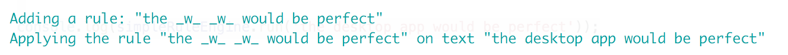
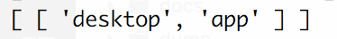

# simple-rules-engine

Simple rules engine written in Node.JS.

## Usage

```
let SimpleRuleEngine = require('../');

simpleRuleEngine = new SimpleRuleEngine();

simpleRuleEngine.add('the _w_ _w_ would be perfect'); // it will extract the placeholder _w_

console.log(simpleRuleEngine.run('the desktop app would be perfect')); // it will extract "dekstop, app"
```

return the following output:




